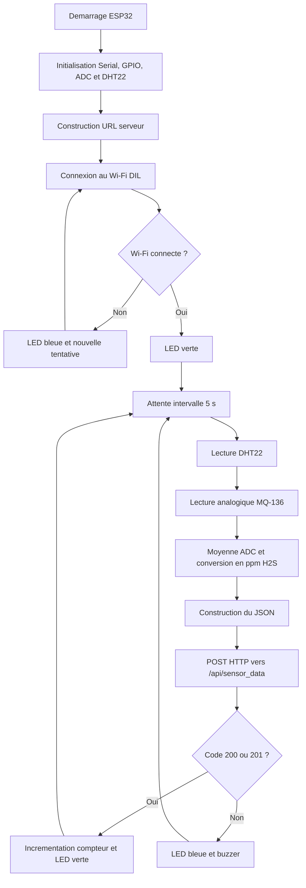

# Rapport de la partie embarquée du système de surveillance H2S

## 1. Introduction

La partie embarquée constitue le niveau terrain du système de surveillance de gaz. Elle est installée au plus près de l’environnement à contrôler et assure l’acquisition des mesures physiques, leur conversion en données numériques, puis leur transmission vers le serveur de supervision. Dans ce projet, cette partie embarquée repose sur une carte ESP32 DevKit V1 associée à un capteur MQ-136 pour la détection du sulfure d’hydrogène (H2S), à un capteur DHT22 pour la température et l’humidité, à une LED RGB et à un buzzer pour les indications locales.

Le rôle de ce module est de collecter périodiquement les données du terrain et de les envoyer par Wi-Fi au serveur Flask. Les données reçues par le serveur sont ensuite traitées par les modèles d’intelligence artificielle Random Forest et LSTM, enregistrées dans la base de données et affichées en temps réel sur le tableau de bord Web.

La version actuelle du prototype utilise un seul capteur de gaz : le MQ-136. Aucun capteur CO n’est utilisé et aucun champ `co_ppm` n’est transmis par l’ESP32.

## 2. Objectifs de la partie embarquée

La partie embarquée répond aux objectifs suivants :

- mesurer la concentration de H2S à l’aide du capteur MQ-136 ;
- mesurer la température et l’humidité à l’aide du DHT22 ;
- convertir les signaux analogiques et numériques en valeurs exploitables ;
- établir automatiquement une connexion au réseau Wi-Fi ;
- transmettre les mesures au serveur Flask par requête HTTP REST ;
- indiquer localement l’état de fonctionnement à l’aide de la LED RGB et du buzzer ;
- assurer une reconnexion automatique en cas de perte temporaire du réseau ;
- alimenter le tableau de bord Web, la base de données et les modules d’intelligence artificielle.

## 3. Architecture matérielle embarquée

L’architecture matérielle est centrée sur la carte ESP32 DevKit V1. Cette carte joue le rôle d’unité de traitement locale : elle lit les capteurs, prépare les données, gère la connexion Wi-Fi et transmet les informations au serveur.

Les composants principaux sont les suivants :

| Composant | Rôle dans le système |
|---|---|
| ESP32 DevKit V1 | Microcontrôleur principal, acquisition, prétraitement et communication Wi-Fi |
| MQ-136 | Capteur de gaz destiné à la mesure du H2S |
| DHT22 | Mesure de la température et de l’humidité relative |
| LED RGB | Indication visuelle de l’état du système |
| Buzzer | Indication sonore en cas d’échec d’envoi ou d’alerte locale |
| Alimentation | Fourniture de l’énergie nécessaire à l’ESP32 et aux capteurs |
| Module GPS | Extension optionnelle pour la géolocalisation, non activée dans le firmware actuel |

## 4. Câblage du prototype

Le câblage respecte une logique simple : tous les modules partagent une masse commune, les signaux des capteurs sont raccordés aux broches d’entrée de l’ESP32 et les actionneurs sont raccordés aux broches de sortie.

| Élément | Broche composant | Broche ESP32 | Type de signal | Remarque |
|---|---:|---:|---|---|
| MQ-136 | AO | GPIO34 | Analogique ADC | Lecture de la concentration H2S |
| MQ-136 | VCC | 3.3 V ou alimentation module compatible | Alimentation | La sortie analogique doit rester compatible 0-3.3 V |
| MQ-136 | GND | GND | Masse | Masse commune obligatoire |
| DHT22 | DATA | GPIO4 | Numérique | Résistance de tirage de 10 kOhm vers 3.3 V recommandée |
| DHT22 | VCC | 3.3 V | Alimentation | Capteur température/humidité |
| DHT22 | GND | GND | Masse | Masse commune obligatoire |
| LED RGB verte | Anode/canal vert | GPIO25 | Sortie numérique | État normal ou envoi réussi |
| LED RGB rouge | Anode/canal rouge | GPIO26 | Sortie numérique | Réservée aux états d’alerte |
| LED RGB bleue | Anode/canal bleu | GPIO27 | Sortie numérique | Échec Wi-Fi ou échec d’envoi |
| Buzzer | Signal | GPIO15 | Sortie numérique | Transistor de commande recommandé |

Pour une réalisation plus fiable, chaque canal de LED doit être protégé par une résistance de limitation de courant. Le buzzer doit de préférence être commandé par un transistor NPN ou un module buzzer adapté, afin d’éviter de tirer un courant trop élevé directement depuis une broche de l’ESP32.

Remarque importante : certains modules MQ-136 sont alimentés en 5 V à cause de leur élément chauffant. Dans ce cas, il faut s’assurer que la tension analogique envoyée vers GPIO34 ne dépasse jamais 3.3 V. Si nécessaire, un pont diviseur ou un conditionnement de signal doit être ajouté.

## 5. Architecture logicielle embarquée

Le programme embarqué est développé avec l’environnement Arduino pour ESP32. Il est organisé autour de quatre fonctions principales : connexion Wi-Fi, acquisition des mesures, conversion de la mesure MQ-136 en ppm et transmission HTTP.

Les bibliothèques utilisées sont :

| Bibliothèque | Utilisation |
|---|---|
| `WiFi.h` | Connexion de l’ESP32 au réseau Wi-Fi |
| `HTTPClient.h` | Envoi des mesures au serveur Flask par HTTP POST |
| `ArduinoJson.h` | Construction du message JSON envoyé au serveur |
| `DHT.h` | Lecture du capteur DHT22 |
| `math.h` | Calculs de conversion du signal MQ-136 en concentration H2S |

La configuration principale du firmware est la suivante :

```cpp
const char* WIFI_SSID = "DIL";
const char* SERVER_IP = "10.67.107.74";
const int SERVER_PORT = 8080;
const char* API_PATH = "/api/sensor_data";
```

Le mot de passe Wi-Fi est configuré dans le sketch Arduino, mais il ne doit pas être publié dans le rapport final pour des raisons de sécurité.

## 6. Fonctionnement général du programme Arduino

Au démarrage, le programme initialise la communication série, configure les broches, initialise le capteur DHT22, prépare l’URL du serveur et tente de connecter l’ESP32 au Wi-Fi. Ensuite, la boucle principale exécute périodiquement le cycle de surveillance.

Le cycle de fonctionnement est le suivant :

1. vérifier si l’intervalle d’envoi est atteint ;
2. lire la température et l’humidité avec le DHT22 ;
3. lire le signal analogique du MQ-136 ;
4. convertir la valeur ADC en concentration H2S exprimée en ppm ;
5. vérifier l’état de la connexion Wi-Fi ;
6. construire un message JSON ;
7. envoyer le JSON au serveur Flask ;
8. interpréter le code HTTP retourné ;
9. signaler l’état par LED RGB et buzzer.

L’intervalle d’envoi configuré est de 5 secondes :

```cpp
const unsigned long SEND_INTERVAL_MS = 5000;
```

Cela signifie que l’ESP32 envoie une nouvelle mesure au serveur toutes les cinq secondes environ.

## 7. Acquisition et conversion de la mesure H2S

Le capteur MQ-136 fournit une sortie analogique liée à la présence de H2S. L’ESP32 lit cette tension sur la broche GPIO34, configurée comme entrée ADC. Le firmware utilise une résolution ADC de 12 bits, ce qui donne une plage numérique de 0 à 4095.

Le programme effectue une moyenne de 20 lectures successives afin de réduire les fluctuations instantanées du signal :

```cpp
for (int i = 0; i < 20; i++) {
  sum += analogRead(PIN_MQ136);
  delay(3);
}
```

La valeur moyenne est ensuite convertie en tension :

```text
Vout = (ADC / 4095) × 3.3
```

À partir de cette tension, le programme estime la résistance du capteur :

```text
Rs = RL × (Vref - Vout) / Vout
```

Puis il calcule le rapport `Rs/R0`, utilisé pour estimer la concentration de H2S :

```text
H2S ppm = A × (Rs/R0)^B
```

Dans le prototype, les constantes utilisées sont :

| Paramètre | Valeur | Signification |
|---|---:|---|
| `MQ136_R0` | 10.0 | Résistance de référence du capteur |
| `MQ136_RL` | 10.0 | Résistance de charge |
| `MQ136_A` | 36.737 | Coefficient de courbe |
| `MQ136_B` | -3.536 | Exposant de courbe |
| `ADC_VREF` | 3.3 | Tension de référence ADC |

Une correction dépendant de la température et de l’humidité est appliquée afin de limiter l’influence des conditions ambiantes :

```text
correction = 1 + 0.005 × (Température - 20) - 0.002 × (Humidité - 50)
```

La valeur finale transmise correspond donc à la concentration H2S estimée, arrondie à deux décimales.

## 8. Mesure de la température et de l’humidité

La température et l’humidité sont mesurées par le capteur DHT22 raccordé à la broche GPIO4. Ces deux grandeurs sont importantes car elles permettent de contextualiser la mesure du gaz et d’améliorer la qualité du traitement côté serveur.

En cas d’échec de lecture du DHT22, le programme utilise des valeurs par défaut pour éviter l’interruption complète du cycle d’envoi :

```cpp
if (isnan(temperatureC)) temperatureC = 25.0f;
if (isnan(humidityPct)) humidityPct = 50.0f;
```

Cette stratégie permet de conserver la continuité de transmission même lorsqu’une lecture ponctuelle du DHT22 échoue.

## 9. Connexion Wi-Fi

La carte ESP32 est configurée en mode station Wi-Fi. Elle se connecte au réseau `DIL`, qui doit être le même réseau que celui utilisé par l’ordinateur exécutant le serveur Flask.

Le serveur est identifié par l’adresse IP suivante :

```text
10.67.107.74
```

L’URL complète utilisée par l’ESP32 est :

```text
http://10.67.107.74:8080/api/sensor_data
```

Le firmware active également l’auto-reconnexion Wi-Fi :

```cpp
WiFi.persistent(false);
WiFi.setAutoReconnect(true);
```

Ainsi, si le signal Wi-Fi est momentanément perdu, l’ESP32 tente de se reconnecter automatiquement sans intervention manuelle.

## 10. Transmission des données au serveur Flask

Après acquisition des données, l’ESP32 construit un objet JSON avec la bibliothèque ArduinoJson. Ce JSON est envoyé au serveur avec une requête HTTP POST.

Exemple de payload envoyé :

```json
{
  "device_id": "CASQUE_001",
  "worker_name": "DANNY LABULU",
  "zone": "Zone H2S",
  "timestamp": 123.45,
  "h2s_ppm": 8.04,
  "temperature": 25.0,
  "humidity": 50.0,
  "exposure_time_s": 120,
  "wifi_rssi": -39,
  "send_count": 10
}
```

Le champ `device_id` permet d’identifier le casque ou le prototype. Le champ `worker_name` permet d’associer la mesure à un opérateur. Le champ `zone` indique la zone surveillée. Le champ `h2s_ppm` représente la concentration estimée en sulfure d’hydrogène. Les champs `temperature` et `humidity` décrivent les conditions environnementales. Le champ `wifi_rssi` donne une indication sur la qualité du signal Wi-Fi.

Aucun champ CO n’est transmis. Le système est donc cohérent avec l’architecture actuelle basée uniquement sur le H2S.

## 11. Réception des données côté serveur

Les données envoyées par l’ESP32 sont reçues par le serveur Flask via l’endpoint suivant :

```text
/api/sensor_data
```

Lorsque le serveur reçoit une mesure, il effectue les opérations suivantes :

1. vérification du format JSON ;
2. extraction de la concentration H2S ;
3. lecture de la température et de l’humidité ;
4. identification du casque avec `device_id` ;
5. traitement par le moteur H2S ;
6. classification du risque avec Random Forest ;
7. prédiction temporelle avec LSTM lorsque le buffer est suffisant ;
8. mise à jour du tableau de bord Web ;
9. émission WebSocket vers l’interface ;
10. enregistrement dans la base de données.

Un endpoint de diagnostic existe également :

```text
/api/connectivity
```

Il sert à vérifier que l’ESP32 arrive bien à joindre le serveur. Toutefois, pour le fonctionnement complet du système, le firmware doit utiliser `/api/sensor_data`.

## 12. Indications locales par LED RGB et buzzer

La LED RGB et le buzzer permettent à l’utilisateur de connaître rapidement l’état du module embarqué sans consulter le tableau de bord.

| État | Signal local |
|---|---|
| Connexion Wi-Fi réussie | LED verte |
| Envoi HTTP réussi | LED verte |
| Échec de connexion ou d’envoi | LED bleue + bip court |
| Démarrage du système | Deux bips courts |

Dans le firmware actuel, la LED rouge est réservée aux évolutions liées aux alertes locales. Les décisions de danger principales sont réalisées côté serveur, après traitement par les modèles IA.

## 13. Organigramme fonctionnel de la partie embarquée



## 14. Tests de connectivité

Pour vérifier la partie embarquée, la procédure de test est la suivante :

1. démarrer le serveur Flask sur l’ordinateur ;
2. vérifier que l’ordinateur est connecté au réseau Wi-Fi `DIL` ;
3. confirmer l’adresse du serveur : `10.67.107.74` ;
4. ouvrir le sketch `esp32_h2s_monitor.ino` dans Arduino IDE ;
5. sélectionner la carte ESP32 DevKit V1 ou ESP32 Dev Module ;
6. sélectionner le bon port série ;
7. téléverser le firmware ;
8. ouvrir le moniteur série à 115200 bauds ;
9. vérifier l’affichage de l’adresse IP locale de l’ESP32 ;
10. vérifier les requêtes POST vers `/api/sensor_data` ;
11. vérifier le code de réponse HTTP `201` ;
12. ouvrir le tableau de bord et vérifier que le casque apparaît en ligne.

Les messages attendus dans le moniteur série sont du type :

```text
[WiFi] Connecte
[WiFi] IP ESP32: xxx.xxx.xxx.xxx
[HTTP] POST http://10.67.107.74:8080/api/sensor_data
[HTTP] Code: 201
```

## 15. Problèmes possibles et solutions

| Problème observé | Cause probable | Solution recommandée |
|---|---|---|
| L’ESP32 est connecté au Wi-Fi mais le dashboard indique hors ligne | Ancien firmware envoyant vers `/api/connectivity` uniquement | Téléverser le firmware corrigé utilisant `/api/sensor_data` |
| Code HTTP négatif ou timeout | Serveur inaccessible ou pare-feu Windows | Vérifier IP, port 8080 et autorisation du pare-feu |
| Code HTTP 500 | Erreur serveur ou modèle IA non chargé | Lire `server_err.log` et vérifier les modèles |
| Code HTTP 403 | Casque désactivé dans la liste des travailleurs | Réactiver le `device_id` dans le dashboard |
| Mesure H2S instable | Capteur non stabilisé ou câblage bruité | Respecter le temps de chauffe, vérifier masse commune et alimentation |
| Valeur H2S incohérente | Calibration MQ-136 approximative | Calibrer `R0`, vérifier `RL`, utiliser un gaz étalon si disponible |
| DHT22 renvoie NaN | Mauvais câblage ou absence de pull-up | Vérifier GPIO4, VCC, GND et résistance 10 kOhm |

## 16. Sécurité et limites du prototype

Le système constitue un prototype intelligent de surveillance H2S. Il permet de démontrer l’acquisition, la transmission et l’analyse en temps réel des données de gaz. Cependant, plusieurs limites doivent être prises en compte avant une utilisation industrielle réelle.

Le capteur MQ-136 nécessite un temps de préchauffage et une calibration rigoureuse. Ses mesures peuvent être influencées par la température, l’humidité, l’alimentation, le vieillissement du capteur et la présence d’autres gaz. Les constantes utilisées dans le firmware permettent une estimation, mais une calibration avec un gaz étalon est nécessaire pour obtenir une mesure fiable en contexte industriel.

L’ESP32 et les composants du prototype ne sont pas certifiés ATEX. Dans un environnement minier réel ou dans une atmosphère potentiellement explosive, il est nécessaire d’utiliser des composants certifiés, un boîtier adapté et une alimentation conforme aux normes de sécurité.

Le module GPS est prévu comme extension optionnelle, mais la version actuelle du firmware ne transmet pas encore de coordonnées GPS réelles. Les champs de localisation peuvent être ajoutés ultérieurement si le module GPS est intégré au câblage et au code.

## 17. Conclusion

La partie embarquée du système assure le lien entre le terrain et la plateforme logicielle. Elle permet de mesurer le H2S, la température et l’humidité, puis de transmettre ces informations au serveur Flask par Wi-Fi. Grâce à l’ESP32, le système dispose d’un module compact, programmable et connecté, capable d’envoyer régulièrement des mesures vers le tableau de bord.

Le firmware actuel est aligné avec l’architecture finale du projet : il utilise un seul capteur de gaz MQ-136, transmet uniquement la concentration H2S et envoie les données vers `/api/sensor_data`, l’endpoint principal du backend. Cette organisation permet au serveur d’effectuer la classification du danger, la prédiction temporelle, l’enregistrement en base de données et l’affichage en temps réel sur le dashboard Web.

Cette partie embarquée constitue donc la base matérielle et logicielle du système intelligent de surveillance H2S. Elle peut être améliorée par une calibration plus poussée du capteur, l’ajout d’un module GPS, une gestion d’alimentation autonome et une conception matérielle certifiée pour les environnements industriels sensibles.